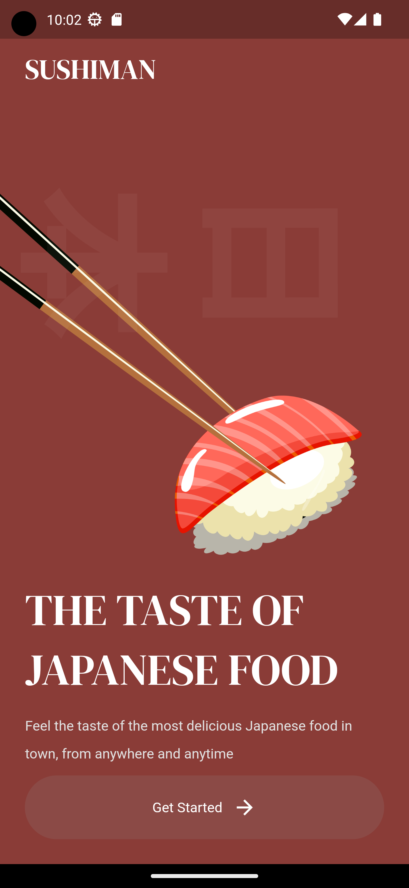
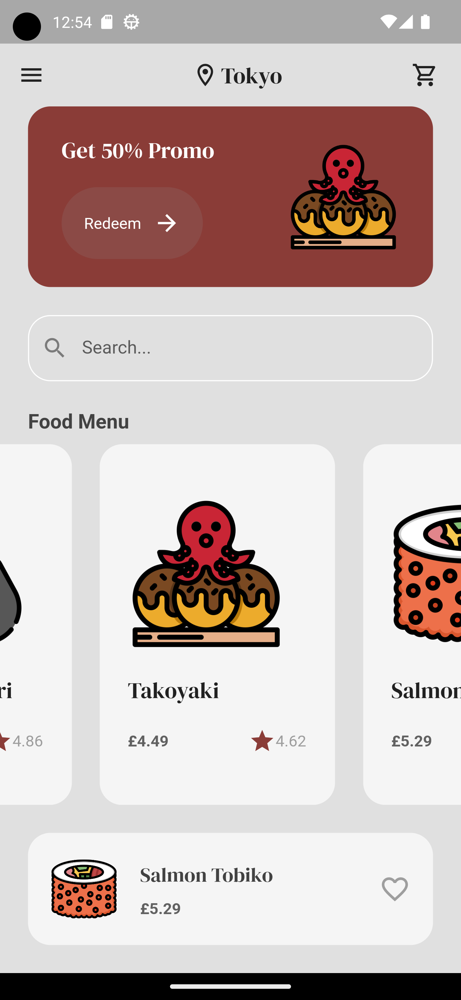
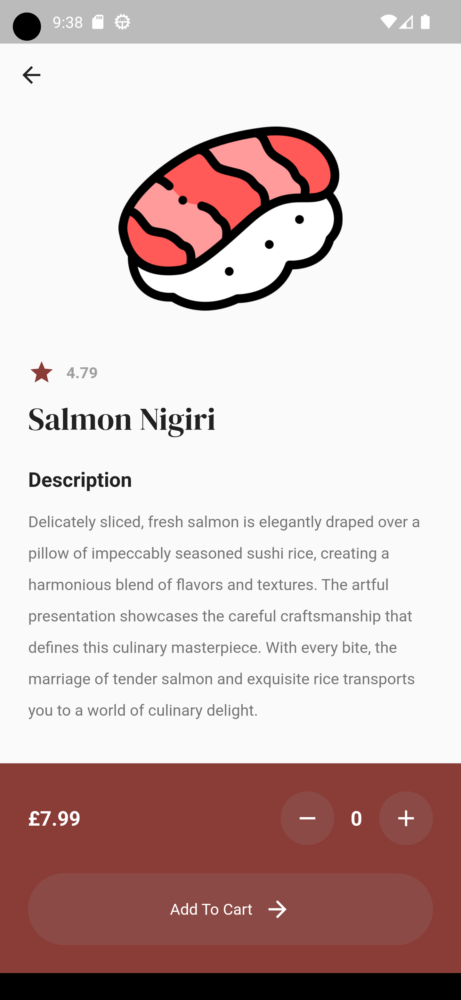
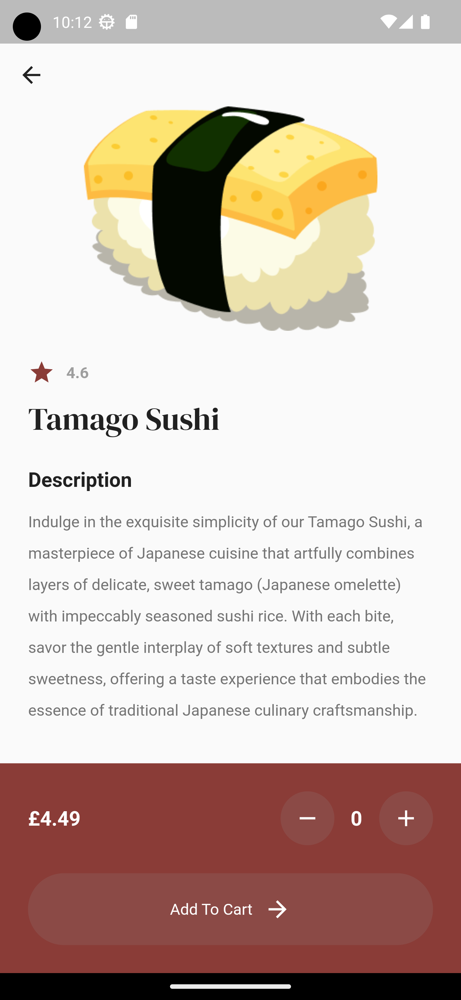

# Flutter_Sushi_Restaurant

    
    
    
    
    

This program is to test flutter and dart, testing out a basic UI for a sushi restaurant.

# Contribution

If you'd like to contribute to `flutter_sushi_restaurant` please submit a pull-request on a feature branch.

# Installing

Clone the repo:

    git clone https://github.com/Sommos/flutter_sushi_restaurant
    cd flutter_sushi_restaurant
