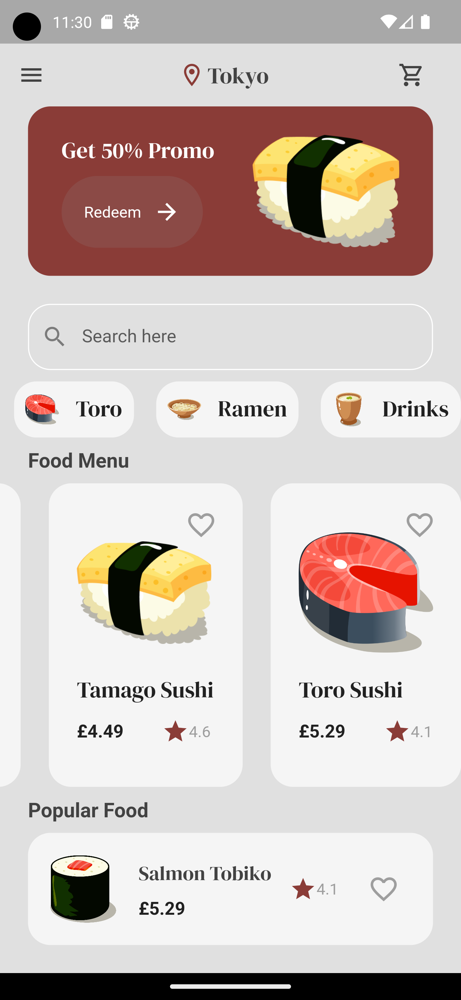

# Flutter_Sushi_Restaurant

<p align="center">
    
    
    
    
    
</p>

This program is to test flutter and dart, testing out a basic UI for a sushi restaurant.

## Getting Started

To get a local copy up and running, follow these steps:

1. Clone the repo:

   ```
   git clone https://github.com/Sommos/flutter_sushi_restaurant
   cd flutter_sushi_restaurant
   ```

2. Install Flutter dependencies:

   ```
   flutter pub get
   ```

3. Run the app:

   ```
   flutter run
   ```

## Setting Up a Virtual Device

Before you can run the app, you need to set up a virtual device. Here's how you can do this:

### Android

1. Download and install [Android Studio](https://developer.android.com/studio).
2. Open Android Studio and click on "AVD Manager" in the toolbar.
3. Click on "Create Virtual Device".
4. Choose a device definition and click "Next".
5. Select a system image that has the "Target" as "Android" and "API Level" as 28 or higher, then click "Next".
6. Verify the configuration and click "Finish".

### iOS (macOS only)

1. Download and install [Xcode](https://developer.apple.com/xcode/).
2. Open Xcode and go to "Preferences".
3. Go to the "Components" tab and download a simulator.

After setting up the virtual device, you can run the app:

```
flutter run
```

## Contribution

If you'd like to contribute to `flutter_sushi_restaurant` please submit a pull-request on a feature branch.

## License

This project is licensed under the [MIT License](LICENSE).
